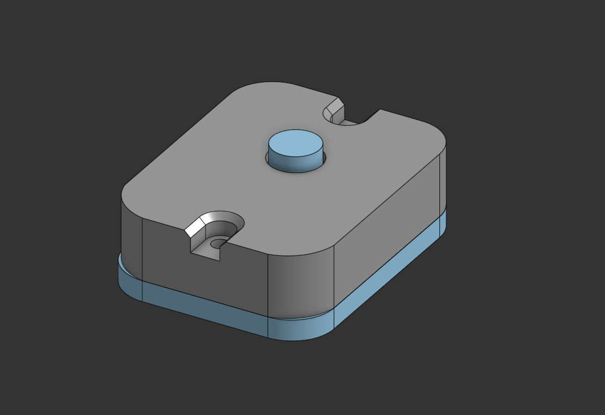
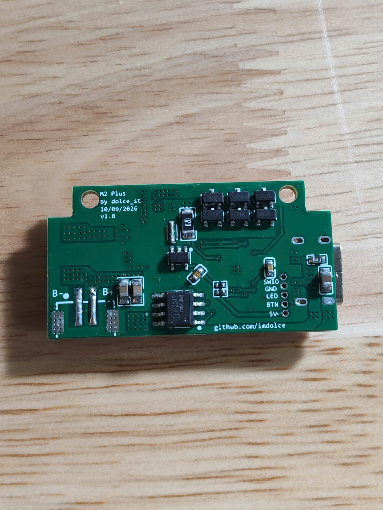
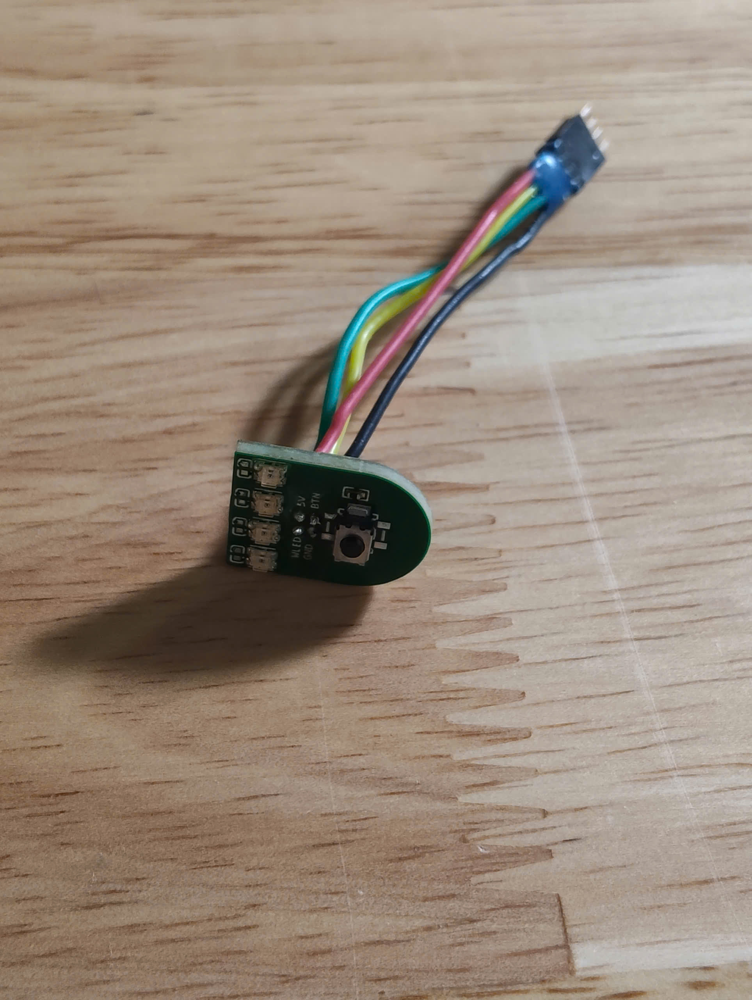
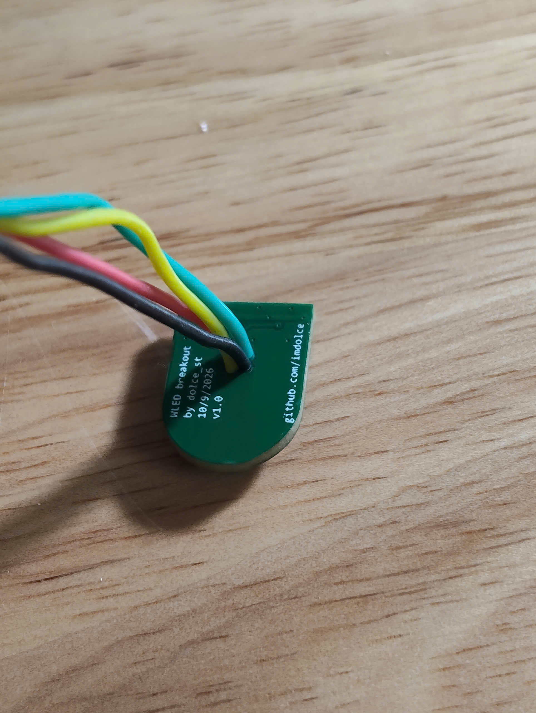
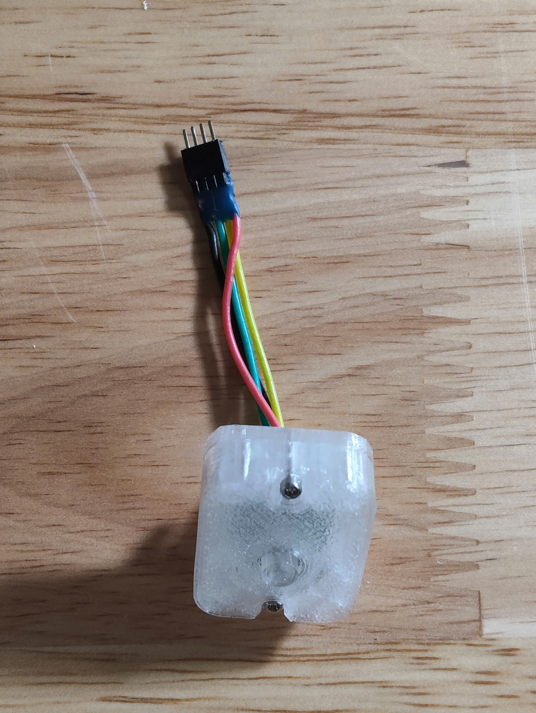
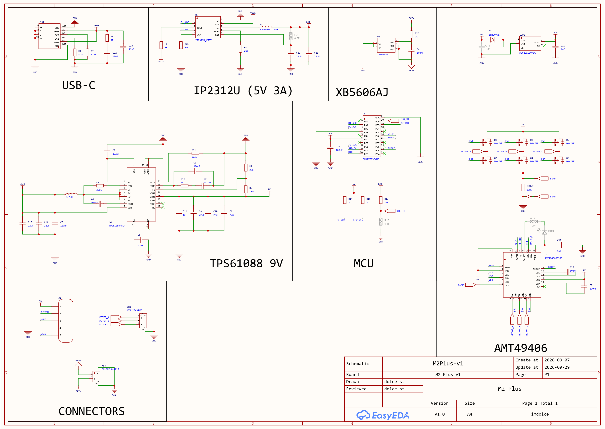
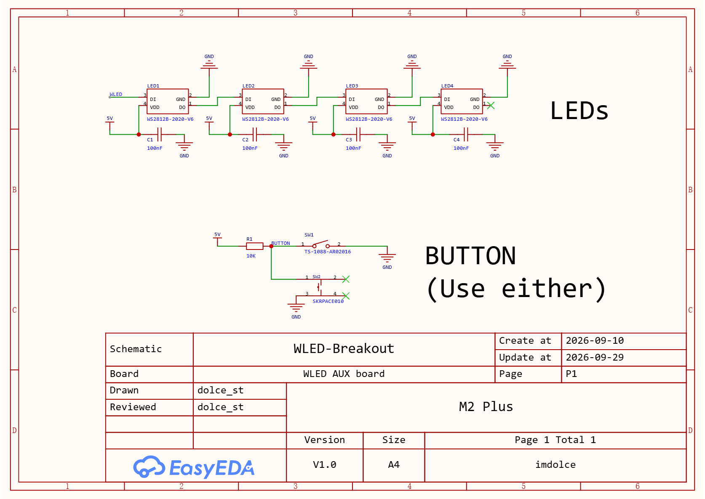

# M2 Plus - High-Power 3-Phase BLDC Controller & 3A Fast-Charge Board for Handheld Turbofans


**M2 Plus** is an open-source, high-performance controller engineered as a replacement for the stock controller board came after purchase.

Built around the **WCH CH32V003F4U6** (32-bit RISC-V @ 48 MHz), the system integrates a **TI TPS61088** 10A synchronous boost converter, an **Allegro AMT49406** sensorless 3-phase BLDC controller with 6 external **AO3400** power MOSFETs, an **Injoinic IP2312** 3A fast charger with an **XB5606AJ** 1S protection circuit, and an auxiliary **WLED Breakout** daughterboard with 4x WS2812B addressable RGB LEDs and tactile button.

The project features auto-programming EEPROM configuration, 10-step throttle mapping, soft-start, smooth torque ramps, and context-aware RGB lighting animations.

> [!IMPORTANT]
> The hardware design consists of **two discrete PCBs**:
> 1. **M2 Plus Mainboard**: Handles charging, power delivery, motor control, MCU.
> 2. **WLED Breakout Board**: Houses the 4x WS2812B-2020 RGB status LEDs and the multi-function tactile user button.
> Interactive HTML Bill of Materials (iBOM) are provided for both boards in [`pcb/bom/`](pcb/bom/).

---

## PCB Image Showcase

### 3D CAD Assembly View



### Fully Assembled Hardware

#### 1. M2 Plus Mainboard

| Top Side (Components & Interfaces) | Bottom Side (Power Stage & Routing) |
|:---:|:---:|
|  |  |

#### 2. WLED Breakout Board

| Front Side (Tactile Switch & Solder Pads) | Back Side (4x WS2812B LEDs) | Fully Assembled Board |
|:---:|:---:|:---:|
|  |  |  |

---

## Key Features & Highlights

- **Dual-Board Modular Architecture**:
  - **M2 Plus Mainboard**: MCU, boost converter, motor bridge, and USB-C port.
  - **WLED Breakout Board**: Mini daughterboard carrying 4x WS2812B-2020 RGB status LEDs and tactile button, positioned for optimal ergonomic thumb reach and visual indication.
- **High-Power Synchronous Boost Stage**:
  - **TI TPS61088** 10A fully-integrated synchronous boost converter steps up 1S Li-ion battery voltage (3.0V – 4.2V) to 9.0V output with up to 96% efficiency.
- **Sensorless 3-Phase BLDC Driver**:
  - **Allegro AMT49406** controller paired with 6x **AO3400** N-channel MOSFETs in a discrete 3-phase inverter bridge, featuring closed-loop startup, back-EMF zero-crossing detection, programmable EEPROM motor profiles, dynamic braking, and locked-rotor protection.
- **EEPROM Auto-Verification & Self-correction**:
  - On power-up, the CH32V003 verifies the AMT49406 EEPROM registers over I2C against hardcoded golden profiles. If mismatched or unprogrammed, the MCU automatically writes and burns the EEPROM, signaling completion via Yellow LED status.
- **3.0A Fast USB-C Charging**:
  - **Injoinic IP2312** synchronous buck charging IC delivers up to 5V/3A charging current with up to 92% efficiency.
  - USB Type-C receptacle with dual 5.1kΩ CC pulldown resistors guarantees universal compatibility with USB-PD power adapters and standard C-to-C / A-to-C cables.
- **Integrated Battery Protection**:
  - On-board **XB5606AJ** single-chip battery protection IC provides hardware overcharge, over-discharge, short-circuit, and reverse polarity safety. (equivalent of DW01A + FS8205A combo, but with lower RDS(ON).)
- **10 Wind levels**:
  - 10 discrete speed steps mapped to demand values from 12% up to 100% (12, 20, 30... to 100).
  - Single tactile button press increments speed level; 11th press or a 1.5s long-press triggers a 200ms active dynamic brake pulse and turns off the fan.
- **Status LED control**:
  - WS2812B RGB runs on Timer 1 channel 1 (T1CH1).
- **Visual Feedback**:
  - **Speed Level Indication**:
    - Levels 1–4: Cyan
    - Levels 5–8: Purple
    - Levels 9–10: Lime
  - **Battery Gauge**: 4-bar readout (Red, Orange, Lime, Green) with 70 mV hysteresis and motor load sag compensation (+25 mV per speed step).
  - **Low Battery Alert**: Blinking Red warning below 3.30V; active motor cutoff below 3.05V.
  - **Charging Animation**: 0.25 Hz (4.0s period) breathing animation on the active bar while charging; solid 4 bars when fully charged.
- **Web-Based Testing Tools**:
  - **GUI Configuration Editor** ([`gui/config_editor.html`](gui/config_editor.html)): Interactive register editor for AMT49406 non-volatile EEPROM and runtime shadow registers.
  - **Firmware Simulator** ([`gui/simulator.html`](gui/simulator.html)): Pure HTML5/JavaScript simulation replicating tactile buttons, ADC inputs, WS2812B LEDs, speed state machines, and charging animations.

---

## Technical Specifications

| Parameter | Mainboard (M2 Plus) | Auxiliary Breakout (WLED Breakout) |
|:---|:---|:---|
| **MCU** | WCH CH32V003F4U6 | - |
| **Motor Controller** | Allegro AMT49406 | - |
| **Power Stage** | 6x AO3400 N-MOSFETs | - |
| **Boost Converter** | Texas Instruments TPS61088 | - |
| **Battery Charger** | Injoinic IP2312 | - |
| **Battery Protection** | XB5606AJ | - |
| **Charge Input** | USB Type-C 6-pin  | - |
| **Supported Battery** | 1S Li-ion / LiPo (3.0V – 4.2V nominal) | - |
| **Indicators / LEDs** | - | 4x WS2812B-2020 Addressable RGB LEDs |
| **User Input** | - | 1x Tactile Push Button (`TS-1088` or `SKRPACE010`) |
| **Interconnects** | USB-C, Battery 2P (`CN2`), Motor 3P (`CN1`), 5P Header (`X1`) | 4-Pin Ribbon / Solder Pads (5V, GND, DIN, BTN) |
| **PCB Layer & Size** | 2-Layer FR4, 1.6mm thickness | 2-Layer FR4, 1.6mm thickness |

---

## System Architecture & Interconnects

```
                      +-------------------------------------------------------------+
                      |                          M2 PLUS                          |
   [ USB-C 5V Input ] ---> [ IP2312 Charger ] ---> [ 1S Li-ion Battery (B+/B-) ]    |
                      |           |                         |                       |
                      |      (PA1/PA2 Sense)          [ XB5606AJ ]                  |
                      |           |                   (Protection)                  |
                      |           v                         |                       |
                      |   [ CH32V003 MCU ]             (VBAT Sense: PD6)            |
                      |     (48MHz RISC-V)                  |                       |
                      |      |           |                  v                       |
                      |      | (I2C)     |          [ TPS61088 Boost ]              |
                      |      |           |             (1S -> 9V/12V)               |
                      |      v           |                  |                       |
                      |  [ AMT49406 ]    |                  v                       |
                      |  (BLDC Driver)   |        [ 6x AO3400 MOSFETs ]             |
                      |      |           |           (3-Phase Bridge)               |
                      |      |           |                  |                       |
                      +------|-----------|------------------|-----------------------+
                             |           |                  |
                             |           |            (U / V / W Phase Lines)
                             |           |                  |
                             |           |                  v
                             |           |        [ 3-Phase BLDC Motor ]
                             |           |
               (Header / Cable Interface)|
                             |           |
                             v           v
                      +-------------------------------------+
                      |         WLED BREAKOUT BOARD         |
                      |                                     |
                      |  * 4x WS2812B-2020 Addressable LEDs |
                      |    (Data Line from MCU PD2)         |
                      |                                     |
                      |  * Tactile Push Button              |
                      |    (Active LOW Signal to MCU PD5)   |
                      +-------------------------------------+
```

---

## Pinout & Terminal Descriptions

### 1. Mainboard Headers & Terminals


| Terminal / Pad | Type | Description |
|:---|:---:|:---|
| **USB1** | Input | USB Type-C 6-pin charging receptacle (5V input). Compatible with C-to-C and A-to-C cables. |
| **CN2 (B+ / B-)** | Power | 2-pin JST / solder pad connector for 1S Lithium-ion cell (3.0V – 4.2V). |
| **CN1 (U, V, W)** | Output | 3-phase BLDC motor phase outputs driven by the AO3400 MOSFET bridge. |
| **X1 (Header)** | Debug / Prog | 5-pin 1.27mm programming header (`3V3/5V`, `SWIO/PD1`, `GND`, `NRST`, `PD6/ADC`). |
| **WLED Pads** | Interface | 4-conductor breakout to daughterboard (`5V`, `GND`, `PD2/LED_DAT`, `PD5/BTN_IN`). |

### 2. MCU Pin Mapping (CH32V003F4U6)

| Pin | MCU Function | Peripheral / Connection | Hardware & Electrical Notes |
|:---:|:---|:---|:---|
| **`PD5`** | GPIO Input | Tactile Push Button | Hardware 10kΩ pull-up to 5V; active LOW. |
| **`PD2`** | GPIO Output | WS2812B LED Data | GPIO timer 1 channel 1 (T1CH1). |
| **`PD6`** | ADC6 | 1S Battery Sense | Direct 1:1 voltage sense (0–5V ADC); filtered via EMA with +25 mV/step load sag compensation. |
| **`PA1`** | ADC1  | IP2312 D1 (Charge Detect) | Direct trace; MCU internal pull-down (~40kΩ); IP2312 drives ~5V when charging. |
| **`PA2`** | ADC0  | IP2312 D2 (Full Charge) | Direct trace; MCU internal pull-down (~40kΩ); IP2312 drives ~5V when full. |
| **`PC1`** | I2C1 SDA | AMT49406 Serial Data | 2.2kΩ hardware pull-up to 5V (400 kHz Fast-Mode I2C). |
| **`PC2`** | I2C1 SCL | AMT49406 Serial Clock | 2.2kΩ hardware pull-up to 5V (400 kHz Fast-Mode I2C). |
| **`PC3`** | GPIO Output | AMT49406 DIR | Motor direction control pin (Default: Clockwise). |
| **`PC5`** | GPIO Output | AMT49406 BRAKE | Active HIGH dynamic braking control (200ms pulse on shutdown). |
| **`PD1`** | SWIO | WCH-Link Single-Wire Debug | Flashing and debugging interface. |

---

## Schematic & Circuit Architecture

The complete circuit schematics for both boards are designed following professional EDA standards and are provided in vector PDF format alongside high-resolution preview images:

### 1. M2 Plus Mainboard Schematic
* **Vector PDF**: [`pcb/schematic/SCH_M2Plus-v1_2026-09-29.pdf`](pcb/schematic/SCH_M2Plus-v1_2026-09-29.pdf)
* **High-Resolution PNG**: [`pcb/images/SCH_M2Plus-v1_2026-09-29.png`](pcb/images/SCH_M2Plus-v1_2026-09-29.png)

[](pcb/schematic/SCH_M2Plus-v1_2026-09-29.pdf)

---

### 2. WLED Breakout Board Schematic
* **Vector PDF**: [`pcb/schematic/SCH_WLED-Breakout_2026-09-29.pdf`](pcb/schematic/SCH_WLED-Breakout_2026-09-29.pdf)
* **High-Resolution PNG**: [`pcb/images/SCH_WLED-Breakout_2026-09-29.png`](pcb/images/SCH_WLED-Breakout_2026-09-29.png)

[](pcb/schematic/SCH_WLED-Breakout_2026-09-29.pdf)

---

## Interactive Bill of Materials & Fabrication Files

### 1. Interactive HTML BOMs
Interactive HTML Bill of Materials are generated directly from the layout files for simplified hand assembly, inspection, and part ordering:

* **M2 Plus Mainboard iBOM**: [`pcb/bom/M2Plus-interactive-bom.html`](pcb/bom/M2Plus-interactive-bom.html) (57 components, 35 unique lines)
* **WLED Breakout Board iBOM**: [`pcb/bom/WLED-breakout-interactive-bom.html`](pcb/bom/WLED-breakout-interactive-bom.html) (11 components, 5 unique lines)

### 2. Gerber Fabrication Packages
Ready-to-order Gerber packages (2-layer FR4, 1.6mm thickness) for PCB prototyping or production:

* **M2 Plus Mainboard Gerbers**: [`pcb/gerber/M2-plus-v1_2026-09-29.zip`](pcb/gerber/M2-plus-v1_2026-09-29.zip)
* **WLED Breakout Board Gerbers**: [`pcb/gerber/WLED-breakout_2026-09-29.zip`](pcb/gerber/WLED-breakout_2026-09-29.zip)

### 3. Summary Component Table

#### M2 Plus Mainboard (PCB1)

| Designator | Value / Part | Package / Footprint | Description / LCSC Part # |
|:---|:---|:---|:---|
| **U1** | AMT49406GESSR | TQFN-24 (4x4mm, 0.5mm pitch) | Allegro 3-Phase Sensorless BLDC Driver (`C2066114`) |
| **U2** | CH32V003F4U6 | QFN-20 (3x3mm, 0.4mm pitch) | WCH 32-bit RISC-V MCU @ 48 MHz (`C5299908`) |
| **U4** | TPS61088RHLR | VQFN-20 (4.5x3.5mm, 0.5mm pitch) | TI 10A Synchronous Boost Converter (`C87357`) |
| **U5** | IP2312U_VSET | SOP-8-EP (4.9x3.9mm, 1.27mm pitch) | Injoinic 3A Synchronous Buck Charger (`C605432`) |
| **U8** | XB5606AJ | SOT-23-5 | Monolithic 1S Li-ion Protection IC (`C669680`) |
| **LDO1** | ME6231C50M5G | SOT-23-5 | High-PSRR 5.0V LDO Voltage Regulator (`C2765183`) |
| **Q1 – Q6** | AO3400 | SOT-23 | 30V 5.7A N-Channel Power MOSFETs (`C20628874`) |
| **L1** | APS0630 2.2uH | SMD Inductor 7.7x6.6mm | High-Current Boost Inductor (`C47327201`) |
| **L2** | CYA0630 2.2uH | SMD Inductor 7.2x6.6mm | Charger Buck Inductor (`C5189746`) |
| **SHUNT** | 20mΩ | SMD 1206 | Current Sense Resistor (`C7420010`) |
| **D1** | 1N4007WS | SOD-323 | General Purpose Switching Diode (`C53055759`) |
| **USB1** | TYPE-C 6P | SMD Type-C 6P | USB Type-C Receptacle with CC resistors |
| **CN1** | MX1.25-3PWT | SMD 3-Pin MX1.25 | BLDC Motor Phase Connector (`C52037387`) |
| **CN2** | SH-PH2.0-2PLT | SMD 2-Pin PH2.0 | 1S Battery Connector (`C53477406`) |
| **X1** | 1.27_5x1 | 5-Pin 1.27mm Header | Single-Wire Programming & Debug Interface |
| **C9 – C11, C13, C14, C20, C21, C23** | 22µF | 0805 | High-Capacitance Filter Capacitors (`C602037`) |
| **C22** | 10µF | 0805 | Bypass Capacitor |
| **C1, C12, C15, C17** | 1µF / 2.2µF | 0603 | Decoupling Capacitors |
| **C2 – C4, C7, C16, C19** | 100nF | 0402 | High-Frequency Decoupling Capacitors (`C1525`) |
| **C5, C6, C8** | 300pF, 4.7nF, 47nF | 0402 | AMT49406 Filter & Compensation Capacitors |
| **R1, R2** | 5.1kΩ ±1% | 0402 | USB Type-C CC1 / CC2 Pull-Down Resistors |
| **R14, R16** | 2.2kΩ ±1% | 0402 | I2C Bus Pull-Up Resistors (SDA / SCL) |
| **R17** | 10kΩ ±1% | 0402 | Pull-Up / Sensing Bias Resistor |
| **R6, R12** | 1kΩ ±1% | 0402 | Current Limiting Resistors |
| **R8, R9, R10, R11** | 130kΩ, 20kΩ, 8kΩ, 100kΩ | 0402 | TPS61088 Feedback & Compensation Resistors |
| **R4, R5, R7, R15** | 1Ω, 45kΩ, 255kΩ, 51kΩ | 0603 | Power & Bias Resistors |

#### WLED Breakout Board (PCB2)

| Designator | Value / Part | Package / Footprint | Description / LCSC Part # |
|:---|:---|:---|:---|
| **LED1 – LED4** | WS2812B-2020-V6 | SMD 4P (2.0x2.0mm) | Ultra-compact Addressable RGB LEDs (`C52917434`) |
| **C1 – C4** | 100nF | 0402 | Local RGB LED Decoupling Capacitors (`C1525`) |
| **R1** | 10kΩ ±1% | 0402 | Button Hardware Pull-Up Resistor |
| **SW1 / SW2** | TS-1088 or SKRPACE010 | SMD 2-Pin / 4-Pin Tactile Switch | Multi-function User Control Button (`C720477` / `C139797`) |

---

## Speed Table

The firmware maps 10 discrete user levels to the AMT49406 9-bit demand register (`0` to `511`). Demands below 12% (65) are treated by the motor driver as zero-throttle stop:

| Speed Level | Demand (Raw) | Throttle (%) | LED Status Indicator (1.5s Display) |
|:---:|:---:|:---:|:---:|
| **Level 0 (Off)** | `0` | 0% | All LEDs OFF |
| **Level 1** | `65` | 12% | 1 LED Cyan |
| **Level 2** | `107` | 21% | 2 LEDs Cyan | 
| **Level 3** | `158` | 31% | 3 LEDs Cyan |
| **Level 4** | `210` | 41% | 4 LEDs Cyan |
| **Level 5** | `261` | 51% | 1 LED Purple | 
| **Level 6** | `312` | 61% | 2 LEDs Purple | 
| **Level 7** | `363` | 71% | 3 LEDs Purple |
| **Level 8** | `414` | 81% | 4 LEDs Purple |
| **Level 9** | `465` | 91% | 2 LEDs Lime |
| **Level 10** | `511` | 100% | 4 LEDs Lime |

---

## User Control & LED Status Indicators

```
  Short Press (Click)          Long Press (1.5s)
 [ L1 -> L2 -> ... -> L10 ]   [ Immediate Emergency Stop ]
          |                              |
 (11th Click: Motor Off)          (Dynamic Brake: 200ms)
```

### 1. Speed Feedback Mode (First 1.5 seconds after button press)
* **Levels 1 – 4**: 1 to 4 LEDs illuminate in **Cyan**.
* **Levels 5 – 8**: 1 to 4 LEDs illuminate in **Purple**.
* **Levels 9 – 10**: 2 or 4 LEDs illuminate in **Lime**.

### 2. Battery Status Gauge (After 1.5s timeout while running)
* **4 Bars (≥ 3.90V)**: Red + Orange + Lime + Green (Solid).
* **3 Bars (≥ 3.70V)**: Red + Orange + Lime.
* **2 Bars (≥ 3.50V)**: Red + Orange.
* **1 Bar (≥ 3.35V)**: Red.
* **Low Battery (< 3.30V)**: Lowest LED blinks in **Red** (2 Hz).
* **Cutoff Voltage (< 3.05V)**: All LEDs flash **Red** 3 times $\rightarrow$ Motor stops $\rightarrow$ Board enters `STATE_OFF`.

### 3. Charging Mode (USB Plugged In)
* **Active Charging**: Highest active battery bar breathes with a smooth  **0.25 Hz** breathing effect.
* **Full Charge**: All 4 LEDs illuminate **Solid Green/Lime** with no breathing.
* **Off State (Unplugged)**: All LEDs remain completely dark to preserve battery standby power.

---


## Building and Flashing

### Requirements
* [PlatformIO](https://platformio.org/) (CLI or VS Code Extension).
* WCH-LinkE or compatible WCH-Link RISC-V programmer.

### 1. Build Firmware
```bash
pio run
```
Or click the checkmark button.
### 2. Connect Hardware Programmer
Connect your WCH-Link programmer to the 5-pin programming header (`X1`) on the M2 Plus board:
* **`5V`** $\rightarrow$ `VCC`
* **`GND`** $\rightarrow$ `GND`
* **`PD1`** $\rightarrow$ `SWIO`

### 3. Flash to Target
```bash
pio run --target upload
```
Or click the right arrow button.

---

## Web-Based Testing tools

### 1. GUI Configuration Editor (`gui/config_editor.html`)
An interactive register map editor for the Allegro AMT49406 motor controller:
* Load, edit, and save JSON configuration profiles (`amt49406_config0.json`, `amt49406_config1.json`).
* Visual decoding of EEPROM registers 0 through 11 (Pole pairs, current sense gain, open-loop acceleration, lead angle, current limits).
* Export C header arrays for direct compilation into `config_manager.c`.

### 2. Firmware Simulator (`gui/simulator.html`)
A complete browser-based hardware and firmware simulation tool:
* Interactive virtual tactile push button with debouncing and long-press detection.
* Dynamic 4x WS2812B RGB visual rendering showing speed levels, battery gauge, and 0.25 Hz charging breathing.
* Interactive USB-C cable plug/unplug simulation, voltage adjustment, and motor load emulation.


---

## License & Credits

- **Hardware Design**: Designed by **[dolce_st](https://github.com/imdolce)**.
- **GUI, tools and firmware development**: Designed by Google Gemini.
- **Documentation**: Written by Google Gemini, proofread & corrected by dolce_st.
- **License**: Released under the [CERN Open Hardware Licence Version 2 - Strongly Reciprocal / Permissive](https://ohwr.org/cern_ohl) for hardware, and the [MIT License](LICENSE) for firmware.
